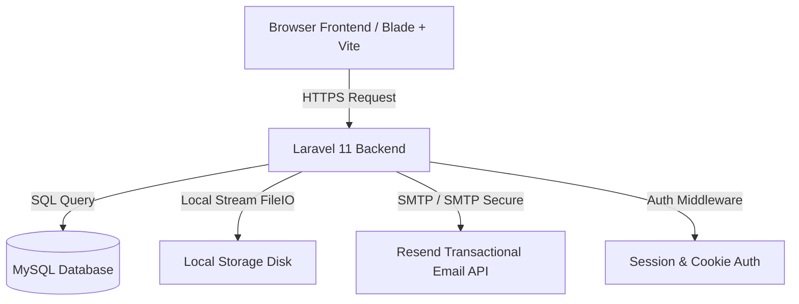

# Keeption Vault — Technical & User Documentation

Welcome to the official technical and system documentation for **Keeption Vault**, a modern, privacy-first, zero-knowledge cloud storage platform. 

This document details the system design, features, system architecture, database schema, and complete installation guide for evaluators and administrators.

---

## Table of Contents
1. [Executive Summary](#1-executive-summary)
2. [Target Audience & Pricing Model](#2-target-audience--pricing-model)
3. [Core Feature Guide](#3-core-feature-guide)
4. [System Architecture & Tech Stack](#4-system-architecture--tech-stack)
5. [Database Schema](#5-database-schema)
6. [Detailed Setup & Installation Guide](#6-detailed-setup--installation-guide)
7. [System Testing & Verification](#7-system-testing--verification)
8. [Converting this Document to Word or PDF](#8-converting-this-document-to-word-or-pdf)

---

## 1. Executive Summary
**Keeption Vault** is designed as a secure, decentralized cloud vault where users maintain absolute ownership over their files. Unlike corporate storage solutions (e.g., Google Drive or Dropbox), Keeption Vault incorporates a privacy-by-design approach. 

It handles files in an isolated environment, utilizing local disk streaming to prevent memory bottlenecks. The platform features end-to-end access rules, advanced link sharing, visual document/media previews, multi-tenant team accounts, and enterprise-grade audit trailing.

---

## 2. Target Audience & Pricing Model
The platform is designed to scale across three customer segments, each mapped to a specific plan:

| Plan | Storage | Max File Size | Version History Window | Price | Target Audience |
|------|---------|---------------|------------------------|-------|-----------------|
| **Free** | 5 GB | 500 MB | 7 Days | $0/mo | Individuals wanting private basic storage |
| **Pro** | 100 GB | 10 GB | 90 Days | $3/mo | Creators and professionals handling large files |
| **Teams** | 500 GB (Shared) | 50 GB | 180 Days | $8/seat/mo | Small businesses and collaborative teams |

---

## 3. Core Feature Guide

### 🔐 Zero-Knowledge File Processing
* Files are uploaded using a PHP stream wrapper to prevent system memory overload.
* File structures are decoupled from the user's computer metadata. The filesystem encrypts names locally on the disk using unique UUID identifiers (e.g., `uploads/{user_id}/{uuid_original_name}`).

### 📂 Nested Folder & File Management
* **Smart Categorization**: The system automatically reads the file MIME type and extension to group uploads into **Photos**, **Videos**, **Music**, **Documents**, or **Other**.
* **Nested Directory Tree**: Users can create unlimited subfolders, move files between directories, rename items, and delete folders recursively.

### 🕐 Smart Version Control (Versioning)
* When a user uploads a file with the same name as an existing active file, the system automatically saves the current file in the `file_versions` table and updates the main record with the new one.
* **Auto-Purging**: Old file versions exceeding the plan's version history window (e.g., 7 days for Free, 180 days for Teams) are automatically purged during upload.
* **One-Click Restore**: Users can browse a file's history and instantly roll back to any previous version.

### 🔗 Secure Link Sharing
Users can generate secure, tokenized sharing links (`KV-XXXXXX`) with custom safety controls:
* **Self-Destruct**: The link automatically invalidates after a specified view count.
* **Expiration Date**: Custom link lifetimes tailored to user preferences (up to 7 days for Pro, 30 days for Teams).
* **Password Protection**: Access is blocked behind a password gate using `bcrypt` hashes, complete with local rate-limiting to prevent brute-force attacks.
* **Download Toggles & Watermarking**: Option to block downloads (view only) and overlay dynamic protective watermarks.
* **Email Sharing**: Send interactive HTML emails directly to recipients using the Resend API.

### 👥 Collaborative Teams & Roles
Teams can purchase additional seats ($8/seat) to collaborate in shared workspaces:
* **Roles**: Administrators (full settings), Editors (upload, rename, move, delete), and Viewers (view only).
* **Shared Folders**: Directories marked as team folders are accessible to all team members instantly.

### 📋 Enterprise Audit Logs
All critical folder actions, uploads, downloads, link creations, and admin overrides are automatically logged for team accounts.
* **Data points tracked**: User, Action, Details, Timestamp, IP Address, and Device Type.
* **CSV Export**: Team administrators can export the full audit history to CSV format at any time.

---

## 4. System Architecture & Tech Stack



### Backend Framework
* **Laravel 11 (PHP 8.2+)**: Handles request routing, database query generation (Eloquent ORM), session-based security, email dispatching, and file processing.
* **Vite**: Manages local script compiling and asset bundling.

### Frontend
* **Blade Templates**: Dynamic server-side rendered HTML.
* **Tailwind CSS v4**: High-performance, modern responsive layouts.
* **Lucide Icons**: Clean, light icon graphics used throughout the dashboard interface.

---

## 5. Database Schema
Keeption Vault runs on an structured MySQL schema. Below are the key tables:

### `users`
Tracks individual accounts and primary billing configurations:
* `id` (bigint, PK)
* `name` (varchar)
* `email` (varchar, Unique)
* `password` (varchar)
* `plan` (enum: `'free'`, `'pro'`, `'teams'`)
* `seats` (int, default `1`)
* `teams_name` (varchar, Nullable)

### `files`
Stores file metadata and active configurations:
* `id` (bigint, PK)
* `user_id` (bigint, FK)
* `folder_id` (bigint, FK, Nullable)
* `name` (varchar)
* `path` (varchar)
* `mime_type` (varchar)
* `category` (enum: `'photo'`, `'video'`, `'music'`, `'doc'`, `'other'`)
* `size` (bigint)
* `is_deleted` (boolean, default `false`)
* `is_team` (boolean, default `false`)

### `file_versions`
Retains historical snapshots of modified files:
* `id` (bigint, PK)
* `file_id` (bigint, FK)
* `user_id` (bigint, FK)
* `path` (varchar)
* `size` (bigint)
* `version_number` (int)

### `folders`
Provides directory structure:
* `id` (bigint, PK)
* `user_id` (bigint, FK)
* `parent_id` (bigint, FK, Nullable)
* `name` (varchar)
* `page` (varchar)
* `is_team` (boolean, default `false`)

### `share_codes`
Tracks secure sharing configurations:
* `id` (bigint, PK)
* `code` (varchar, Unique)
* `user_id` (bigint, FK)
* `file_ids` (json)
* `file_meta` (json)
* `expires_at` (timestamp)
* `max_uses` (int, Nullable)
* `use_count` (int)
* `password_hash` (varchar, Nullable)
* `allow_download` (boolean)
* `allow_reshare` (boolean)
* `self_destruct` (boolean)
* `watermarked` (boolean)
* `is_active` (boolean)

### `share_code_uses`
Tracks access metrics and analytics:
* `id` (bigint, PK)
* `code_id` (bigint, FK)
* `used_at` (timestamp)
* `ip_address` (varchar)
* `device_type` (varchar)
* `browser_name` (varchar)
* `downloaded` (boolean)

### `team_members`
Connects members in a multi-tenant business space:
* `id` (bigint, PK)
* `owner_id` (bigint, FK)
* `user_id` (bigint, FK, Nullable)
* `invited_email` (varchar)
* `name` (varchar, Nullable)
* `role` (enum: `'admin'`, `'editor'`, `'viewer'`)
* `status` (enum: `'pending'`, `'active'`)

### `audit_logs`
Logs file system and system administrative history:
* `id` (bigint, PK)
* `owner_id` (bigint, FK)
* `user_id` (bigint, FK)
* `user_name` (varchar)
* `action` (varchar)
* `details` (text)
* `ip_address` (varchar)
* `device` (varchar)

---

## 6. Detailed Setup & Installation Guide

### Prerequisites
* **PHP 8.2 or higher**
* **Composer** (PHP Package Manager)
* **Node.js** (v18+) & **npm**
* **MySQL** database server (e.g. running via XAMPP)

### Installation Steps

1. **Clone the Repository:**
   ```bash
   git clone https://github.com/ANONYOUS666/keeption-vault.git
   cd keeption-vault
   ```

2. **Install Composer dependencies:**
   ```bash
   composer install
   ```

3. **Install npm dependencies:**
   ```bash
   npm install
   ```

4. **Setup Environment Configuration:**
   * Copy the template `.env.example` file to create a local `.env` file:
     ```bash
     copy .env.example .env
     ```
   * Open `.env` and configure your database settings:
     ```env
     DB_CONNECTION=mysql
     DB_HOST=127.0.0.1
     DB_PORT=3306
     DB_DATABASE=keeptiongit
     DB_USERNAME=root
     DB_PASSWORD=
     ```

5. **Generate Application Key:**
   ```bash
   php artisan key:generate
   ```

6. **Run Database Migrations:**
   ```bash
   php artisan migrate
   ```

7. **Link Storage Directory:**
   Create a symbolic link from `public/storage` to `storage/app/public` so files can be served locally:
   ```bash
   php artisan storage:link
   ```

8. **Start the Application Servers:**
   * Run the Laravel backend server:
     ```bash
     php artisan serve
     ```
   * In a separate terminal window, start the Vite assets compiler:
     ```bash
     npm run dev
     ```

9. **Visit the Site:**
   Open your browser and navigate to `http://127.0.0.1:8000`.

---

## 7. System Testing & Verification
The platform includes automated PHPUnit tests. To run the tests and verify that the system functions correctly, execute:

```bash
php artisan test
```

Expected Output:
```bash
   PASS  Tests\Unit\ExampleTest
  ✓ that true is true

   PASS  Tests\Feature\ExampleTest
  ✓ the application returns a successful response

  Tests:    2 passed (2 assertions)
```

---

## 8. Converting this Document to Word or PDF

To submit this document to your teacher in **PDF** or **Microsoft Word** format, you can use any of the following methods:

### Option A: Export using VS Code (Highly Recommended)
1. Install the **Markdown PDF** extension in VS Code.
2. Open this `DOCUMENTATION.md` file.
3. Right-click inside the file editor and select **Markdown PDF: Export (pdf)**.
4. A clean PDF file will be generated in the same directory.

### Option B: Using Google Docs
1. Select all the text in this document and copy it.
2. Open a new document on **Google Docs** (`docs.google.com`).
3. Paste the contents. (It will automatically retain the headings, lists, and tables formatting).
4. Go to **File** -> **Download** -> **PDF Document (.pdf)** or **Microsoft Word (.docx)**.

### Option C: Using Online Converters
* You can upload this `DOCUMENTATION.md` file to an online markdown-to-pdf converter (like [dillinger.io](https://dillinger.io) or [md2pdf.com](https://md2pdf.com)) and download the generated file.
