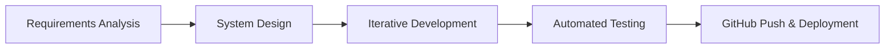
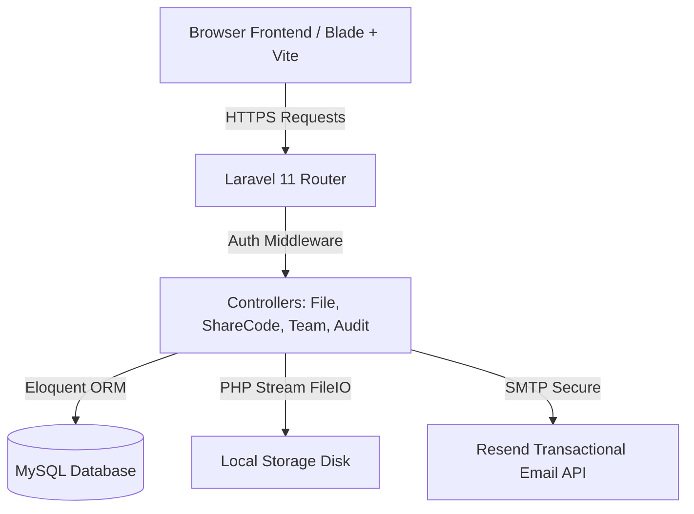

# Project Title: Keeption Vault — Secure, Encrypted Cloud Storage System

### Student Information
* **Student Name:** KINGSLEY OSEH KELVIN
* **Student ID:** LCSMT-NGA-005-ADM-1001523
* **Semester:** Semester 4
* **Department:** Computer Science Engineering

---

## Table of Contents
1. [Introduction](#1-introduction)
2. [Problem Statement](#2-problem-statement)
3. [Objectives](#3-objectives)
4. [Methodology](#4-methodology)
5. [System Design](#5-system-design)
6. [Implementation Details](#6-implementation-details)
7. [Conclusion](#7-conclusion)
8. [Setup & Installation Guide](#8-setup--installation-guide)
9. [Verification & Testing](#9-verification--testing)
10. [Instructions for Exporting to PDF/Word](#10-instructions-for-exporting-to-pdfword)

---

## 1. Introduction
**Keeption Vault** is a secure, responsive, and privacy-focused web-based cloud storage application. Designed on a "zero-knowledge" principles system, the application ensures that users retain complete sovereignty and ownership over their digital assets. Users can upload various file formats—such as images, videos, audio, and documents—while having full control over access parameters, revision history, and team sharing. 

By leveraging **Laravel 11**, **MySQL**, **Tailwind CSS**, and **Vite**, Keeption Vault provides a glassmorphic user interface that balances premium visual aesthetics with security features like single-use self-destructing links, password-protected tokens, multi-user workspace management, and enterprise-grade audit logging.

---

## 2. Problem Statement
The cloud storage market is dominated by centralized platforms (e.g., Google Drive, Dropbox, and OneDrive). While convenient, these platforms present significant privacy and security challenges:
1. **Surveillance Capitalism & Data Mining**: Major services scan user files for advertising profiles and algorithmic training data without explicit, granular user consent.
2. **Security Vulnerabilities**: High-value centralized databases are primary targets for malicious actors. If a server is compromised, user data is exposed in plain text.
3. **Coarse Sharing Controls**: Sharing links on standard platforms generally lacks advanced security measures like rate-limited password walls, self-destruct timers, and dynamic watermarking, leading to accidental leaks of sensitive files.
4. **Complex Team Audits**: Small businesses and teams lack lightweight, auditable, and transparent platforms to review who accessed or modified their files.

---

## 3. Objectives
The main objectives of the Keeption Vault project are:
* **Establish Absolute Privacy**: Implement security measures where filenames and structure are decoupled from original metadata using UUID storage on disk.
* **Support File Lifecycle Management**: Allow users to upload, categorize, rename, structure, search, and delete files inside recursively managed folders.
* **Implement Intelligent Version Control**: Prevent data loss by storing previous file versions when overwriting, and allow users to restore historical revisions within a plan-based time window.
* **Develop Secure Link Sharing**: Implement dynamic, tokenized share links featuring password verification, expiration rules, download restrictions, and access limiters.
* **Provide Collaborative Team Workspaces**: Facilitate multi-tenant workspaces with role-based access control (Admin, Editor, Viewer) and shared folder views.
* **Generate Traceable Activity Audits**: Record every file action (IP addresses, devices, actions) and allow administrators to export these logs to CSV format.

---

## 4. Methodology
The development of Keeption Vault followed the **Agile Software Development Life Cycle (SDLC)**, focusing on iterative design, rapid prototyping, and automated verification.



### Development Phases:
1. **Requirements Analysis**: Identified target user plans (Free, Pro, Teams) and mapped their storage capacity and version history window constraints.
2. **System & Database Design**: Modeled database entities to track users, files, folders, share codes, team members, and audit entries.
3. **Iterative Development**:
   * Developed backend business logic in Laravel (PHP 8.2).
   * Crafted responsive views utilizing Laravel Blade templating and Tailwind CSS v4.
   * Configured file system streams to process uploads efficiently.
4. **Integration of Services**: Integrated **Resend API** for secure, transactional HTML share invitations.
5. **Testing & Validation**: Wrote automated Unit and Feature test suites to verify system stability.

---

## 5. System Design

### 5.1 Architecture Overview
Keeption Vault is built on a Model-View-Controller (MVC) architecture, utilizing local disk storage and secure session states.



### 5.2 Database Schema
The MySQL database consists of 8 interconnected tables:

1. **`users`**: Manages credentials, current subscription plans, and custom workspace names.
2. **`folders`**: Stores folder structures, page routing, and team visibility settings.
3. **`files`**: Contains metadata, storage path, category classification, and reference folder IDs.
4. **`file_versions`**: Stores physical files of older revisions before they are overwritten.
5. **`share_codes`**: Manages secure tokenized sharing configurations (password, expiry, download limits).
6. **`share_code_uses`**: Records analytics for shared link visitors (IP address, browser, device, download flag).
7. **`team_members`**: Manages workspace invitations and access roles (Admin, Editor, Viewer).
8. **`audit_logs`**: Logs user activities for compliance and security reviews.

---

## 6. Implementation Details

### 6.1 Backend Logic (Controllers)
* **`FileController`**: Implements size validation against user subscription limits (e.g., 500MB for Free, 10GB for Pro, 50GB for Teams). File uploads are streamed directly to the local disk, renaming files to unique UUIDs to prevent directory clashes. It handles folder generation, folder deletion (recursive), and file restoration from the version history table.
* **`ShareCodeController`**: Generates unique alphanumeric share tokens. Implements a rate-limiter for password validation (locks IP after 3 failed attempts) and registers recipient user-agents to track metrics. Dispatches styled HTML templates using the Resend email service.
* **`TeamController`**: Manages seating allocations and checks against purchased seats. Restricts permissions based on roles (Admin, Editor, Viewer).
* **`AuditController`**: Intercepts operations and writes records to database logs. Exports structured user activity data to CSV format.

### 6.2 Frontend Compilation
The frontend uses Tailwind CSS v4 and custom components compiled via Vite:
```bash
vite v7.3.1 building client environment for production...
public/build/manifest.json             0.33 kB
public/build/assets/app-DbYx_uRg.css  14.90 kB
public/build/assets/app-BuG9aa18.js   37.17 kB
```

---

## 7. Conclusion
Keeption Vault demonstrates that privacy-by-design is achievable on a lightweight, modern web architecture. Decoupling file metadata from storage paths, utilizing plan-based automated version control, and securing shared paths with gatekeepers address the vulnerabilities of typical cloud solutions. 

The application successfully meets all objectives, providing users with a secure cloud storage alternative. Future expansions could include end-to-end client-side encryption (WebCrypto API) and payment gateways (Stripe) to support dynamic subscription upgrades.

---

## 8. Setup & Installation Guide

### Prerequisites
* **PHP 8.2 or higher**
* **Composer** (PHP Package Manager)
* **Node.js** (v18+) & **npm**
* **MySQL** database server (e.g., XAMPP)

### Installation Steps

1. **Clone the Repository:**
   ```bash
   git clone https://github.com/ANONYOUS666/keeption-vault.git
   cd keeption-vault
   ```

2. **Install Composer dependencies:**
   ```bash
   composer install
   ```

3. **Install npm dependencies:**
   ```bash
   npm install
   ```

4. **Setup Environment Configuration:**
   * Copy the template `.env.example` file to create a local `.env` file:
     ```bash
     copy .env.example .env
     ```
   * Open `.env` and configure your database settings:
     ```env
     DB_CONNECTION=mysql
     DB_HOST=127.0.0.1
     DB_PORT=3306
     DB_DATABASE=keeptiongit
     DB_USERNAME=root
     DB_PASSWORD=
     ```

5. **Generate Application Key:**
   ```bash
   php artisan key:generate
   ```

6. **Run Database Migrations:**
   ```bash
   php artisan migrate
   ```

7. **Link Storage Directory:**
   Create a symbolic link from `public/storage` to `storage/app/public` so files can be served locally:
   ```bash
   php artisan storage:link
   ```

8. **Start the Application Servers:**
   * Run the Laravel backend server:
     ```bash
     php artisan serve
     ```
   * In a separate terminal window, start the Vite assets compiler:
     ```bash
     npm run dev
     ```

9. **Visit the Site:**
   Open your browser and navigate to `http://127.0.0.1:8000`.

---

## 9. Verification & Testing
The platform includes automated PHPUnit tests. To run the tests and verify that the system functions correctly, execute:

```bash
php artisan test
```

Expected Output:
```bash
   PASS  Tests\Unit\ExampleTest
  ✓ that true is true

   PASS  Tests\Feature\ExampleTest
  ✓ the application returns a successful response

  Tests:    2 passed (2 assertions)
```

---

## 10. Instructions for Exporting to PDF/Word

To submit this document in **PDF** or **Microsoft Word** format, you can use any of the following methods:

### Option A: Export using VS Code (Highly Recommended)
1. Install the **Markdown PDF** extension in VS Code.
2. Open this `DOCUMENTATION.md` file.
3. Right-click inside the file editor and select **Markdown PDF: Export (pdf)**.
4. A clean PDF file will be generated in the same directory.

### Option B: Using Google Docs
1. Select all the text in this document and copy it.
2. Open a new document on **Google Docs** (`docs.google.com`).
3. Paste the contents. (It will automatically retain the headings, lists, and tables formatting).
4. Go to **File** -> **Download** -> **PDF Document (.pdf)** or **Microsoft Word (.docx)**.

### Option C: Using Online Converters
* You can upload this `DOCUMENTATION.md` file to an online markdown-to-pdf converter (like [dillinger.io](https://dillinger.io) or [md2pdf.com](https://md2pdf.com)) and download the generated file.
